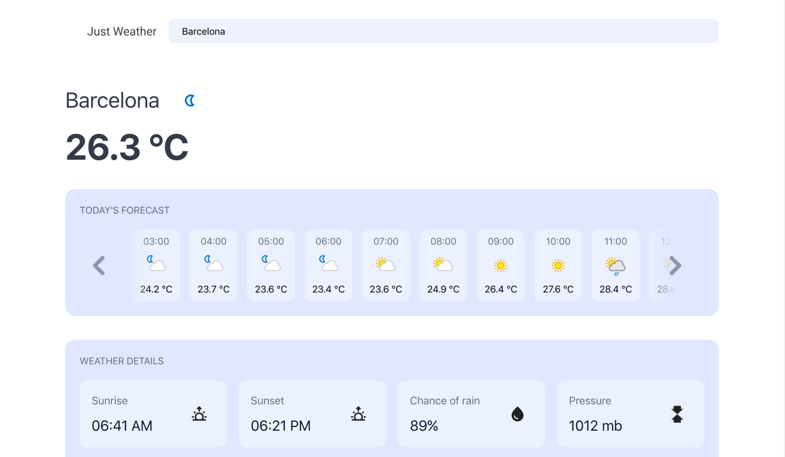
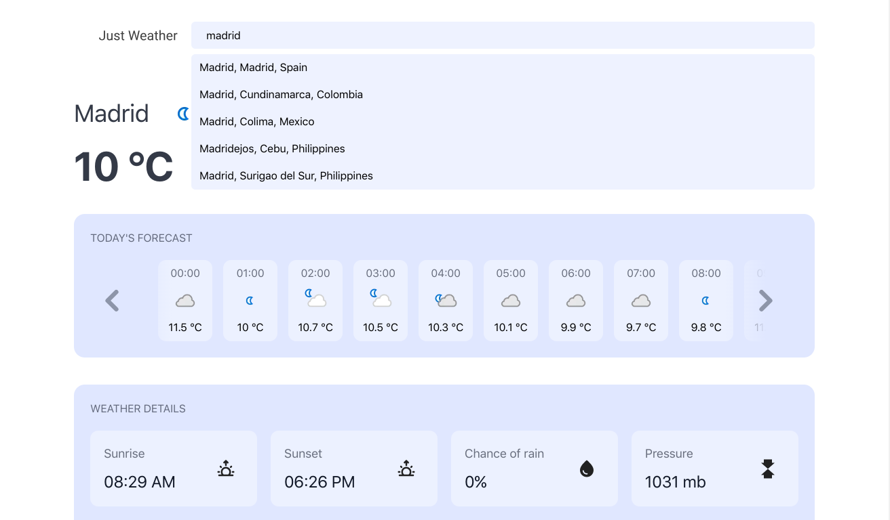
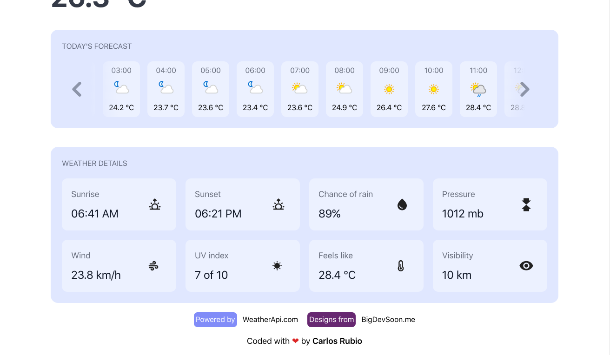
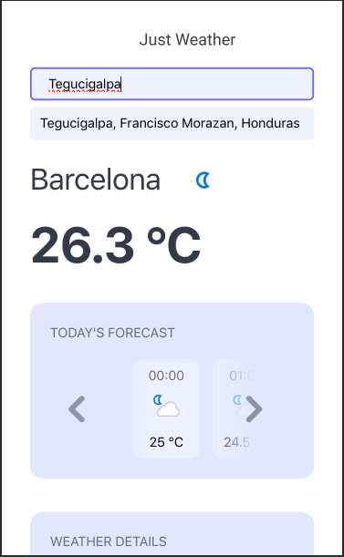
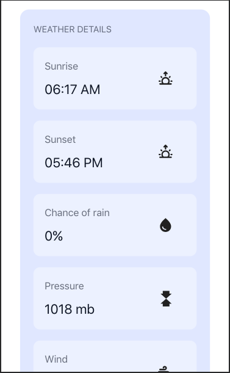
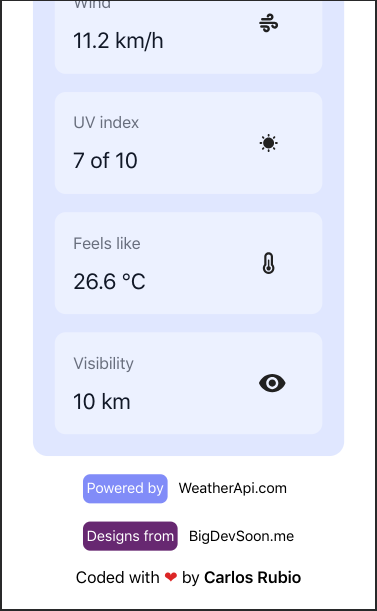

# Weather app ☀️

Aplicacion para poder obtener pronosticos acerca del clima en un determinado lugar del mundo.

## Tabla de contenido 📅​
  - [Screenshots](#screenshots-​📷​)
  - [Links](#links-📍)
  - [Built with](#built-with-🤖​)
  - [Developer](#developer-⚔️​)

## SCREENSHOTS ​📷​

## Links 📍
  - Powered by: [Weather API](https://www.weatherapi.com/)

  - Design by: [BigDevSoon](https://bigdevsoon.me/)

## Built with 🤖​
  - Reactjs
  - TailwindJS
  - Grid
  - Flexbox
  - Mobile first Workflow
  - Custom hooks
  - Context API
  - Debouncing Mechanism

## Developer ⚔️​
  - [Carlos Rubio](https://github.com/Reyniery-Carlitos) ​🐺​
